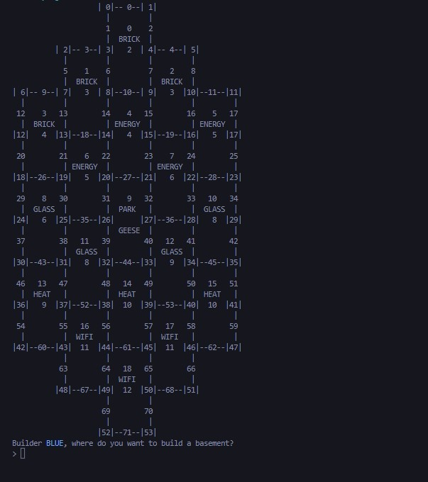

# Catan

## How to run

The executable should be ready to go, just run ```./constructor```

If not working, run the make file with ```make``` on GNU or ```mingw32-make``` on MingW compilers.


## Rules of the game

1. 19 tiles, each containing a value and a resource: BRICK, ENERGY, GLASS, HEAT, WIFI, and PARK
2. Each edge can contain one road owned by a player, and each vertex can contain at most one property. No two properties can lie on adjacent verticies
3. Players start out with two basements (tier 1 properties) and can build roads and upgraded properties (houses, towers) with resources
4. A player can only build properties connected to their roads, each
5. After the die is rolled, tiles with values corresponding to the rolled value will give resources to players with properties on the tile
6. A geese can be moved around to prevent a tile from returning resources
7. Players can trade resources
8. First player to get 10 building points wins (1 for basement, 2 for house, 3 for tower)



A potential game state seen above